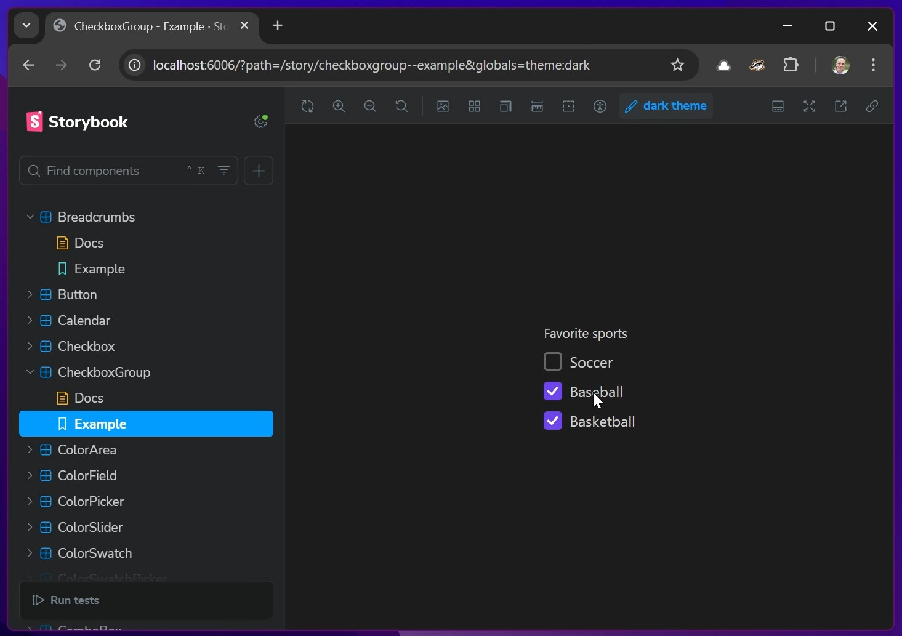

# React Aria Starter

NOTE: This is simply an updated version of the [starter kit download](https://react-spectrum.adobe.com/react-aria/getting-started.html) - upgrading to Storybook 8 including a theme switcher for light and dark modes in Storybook. 


[](react-aria-starter.mp4 "React Aria Starter")

Welcome to React Aria! This starter kit includes a [Storybook](https://storybook.js.org/) containing all of the examples in the docs. You can modify any of the components or their corresponding CSS files to play around or bootstrap your own component library.

To get started, run the following commands:

```shell
pnpm install
pnpm storybook
```

## Building for Production

This starter uses [CSS Nesting](https://drafts.csswg.org/css-nesting/), which is supported in the latest version of all major browsers, but if further support is needed, you can compile this to flattened selectors by enabling the feature in [Lightning CSS](https://lightningcss.dev/docs.html) or using the [PostCSS Nesting](https://github.com/csstools/postcss-plugins/tree/main/plugins/postcss-nesting#usage) plugin in your build.
